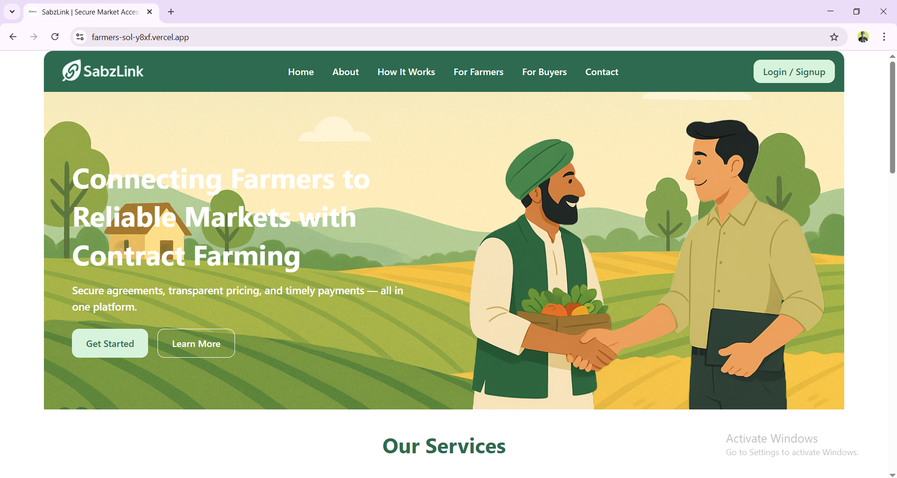

# SabzLink – Assured Contract Farming Platform 🌿

SabzLink is a digital platform designed to bridge the gap between farmers and buyers through secure and transparent contract farming.

## 🔗 Live Demo / Project Repo
This is a collaborative project developed with a teammate.  
➡️ **Main Repo**: [https://github.com/Abdulbasit219/Farmers-Sol](https://github.com/Abdulbasit219/Farmers-Sol)

---

## 🛠️ Tech Stack
- React + Vite
- Tailwind CSS
- Git / GitHub
- Node Js
- Express
- MangoDB

---

## 📸 Screenshots

---

## ✨ Features
- Secure contract creation and management
- Responsive design
- Reusable UI components
- Farmer-buyer dashboard (WIP)

---

## 🤝 Collaborators
- **Frontend Developer**: [Ghulam Ali](https://github.com/ghulamali17)
- **Backend & Repo Owner**: [Abdul Basit](https://github.com/Abdulbasit219)

---

